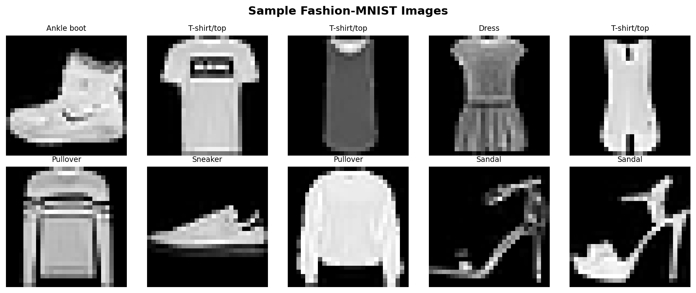
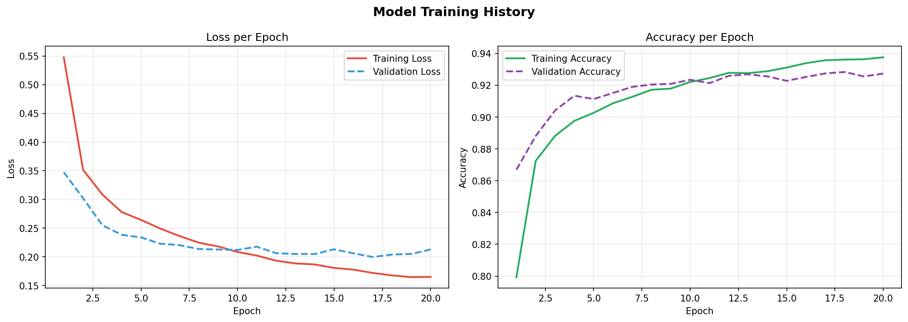
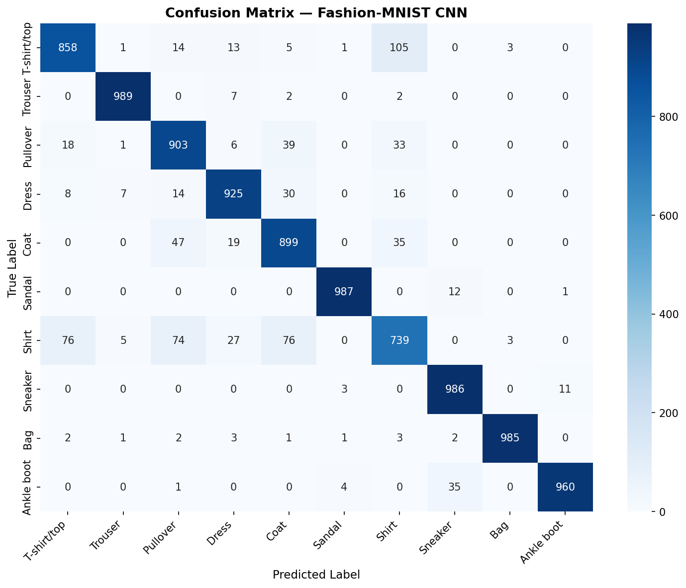
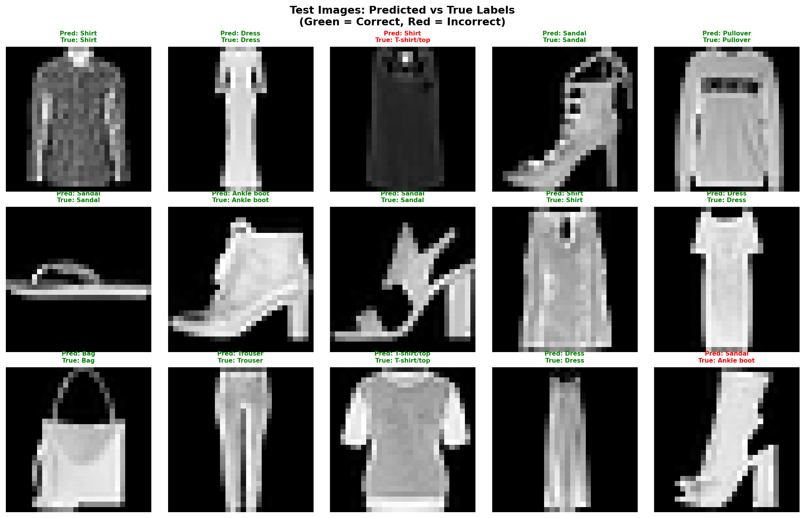

# Fashion-MNIST Classification with a Convolutional Neural Network

A CNN built with TensorFlow/Keras that classifies grayscale clothing images into 10 categories, trained and evaluated on the Fashion-MNIST dataset, with an optional Gradio demo for testing the model on your own images.

## The Problem

Fashion-MNIST is a drop-in replacement for the original MNIST digit dataset, except the images are pictures of clothing items instead of handwritten digits. It exists because plain MNIST became too easy: simple models can hit 99%+ accuracy on it, which makes it a poor benchmark for comparing architectures. Fashion-MNIST keeps the same format (60,000 training images, 10,000 test images, 28x28 grayscale) but is meaningfully harder, since several clothing categories look visually similar to each other.

The dataset has 10 classes:

| Label | Class |
|---|---|
| 0 | T-shirt/top |
| 1 | Trouser |
| 2 | Pullover |
| 3 | Dress |
| 4 | Coat |
| 5 | Sandal |
| 6 | Shirt |
| 7 | Sneaker |
| 8 | Bag |
| 9 | Ankle boot |

The task is straightforward image classification: given a 28x28 grayscale image, predict which of the 10 classes it belongs to.



## Why a CNN, and Why This Architecture

A convolutional neural network is the standard choice for image classification because convolutional layers exploit spatial structure: a filter that detects an edge in the top-left corner of an image is useful for detecting that same edge anywhere else in the image too. A plain dense network would have to learn that pattern separately for every pixel position, which wastes parameters and generalizes worse.

For a dataset this size (28x28, single channel, 60,000 training images), a deep pretrained network like ResNet or VGG would be overkill and likely to overfit, those architectures are designed for much larger, higher-resolution, multi-channel images. A small custom CNN trained from scratch is both sufficient and appropriate here.

**Architecture used in this notebook:**

```
Conv2D(32) -> MaxPool -> Dropout(0.25)
Conv2D(64) -> MaxPool -> Dropout(0.25)
Conv2D(128) -> Dropout(0.25)
Flatten -> Dense(256) -> Dropout(0.5) -> Dense(10, softmax)
```

Reasoning behind the key choices:

- **Increasing filter counts (32 -> 64 -> 128):** earlier layers learn simple, generic features like edges and textures; deeper layers combine these into more abstract, class-specific patterns such as collar shapes or sleeve outlines.
- **`padding='same'` on every conv layer:** keeps spatial dimensions predictable after each convolution, so only the `MaxPooling2D` layers are responsible for reducing resolution.
- **Dropout after every block:** with roughly 1.7 million trainable parameters and only 60,000 training images, overfitting is a real risk. Dropout forces the network to not rely on any single neuron too heavily.
- **Only two MaxPooling layers, not three:** by the third convolutional block the feature map is already down to 7x7. Pooling it again would throw away too much spatial information before the dense layers ever see it.
- **Adam optimizer:** adapts the learning rate per parameter and converges reliably with minimal manual tuning, the standard default for this kind of problem.
- **Sparse categorical crossentropy:** used instead of plain categorical crossentropy because the labels are integers (0-9) rather than one-hot vectors, which avoids an unnecessary preprocessing step.
- **Accuracy as the tracked metric:** each class has exactly 1,000 test samples, so the dataset is balanced and accuracy isn't a misleading metric here the way it can be on imbalanced data.

This is a deliberately standard architecture for small grayscale image classification, nothing exotic. The goal is a solid, explainable baseline rather than a state-of-the-art result.

## Model Summary

| Layer | Output Shape | Parameters |
|---|---|---|
| conv1 (Conv2D, 32 filters) | (28, 28, 32) | 320 |
| pool1 (MaxPooling2D) | (14, 14, 32) | 0 |
| dropout1 (0.25) | (14, 14, 32) | 0 |
| conv2 (Conv2D, 64 filters) | (14, 14, 64) | 18,496 |
| pool2 (MaxPooling2D) | (7, 7, 64) | 0 |
| dropout2 (0.25) | (7, 7, 64) | 0 |
| conv3 (Conv2D, 128 filters) | (7, 7, 128) | 73,856 |
| dropout3 (0.25) | (7, 7, 128) | 0 |
| flatten | (6272,) | 0 |
| dense1 (256 units) | (256,) | 1,605,888 |
| dropout4 (0.5) | (256,) | 0 |
| output (10 units, softmax) | (10,) | 2,570 |

**Total trainable parameters: 1,701,130**

Most of the parameter budget sits in `dense1` alone (1.6M out of 1.7M total). This is typical for CNNs that flatten a moderately sized feature map straight into a wide dense layer, and it is also exactly why `dropout4` (0.5, the heaviest dropout rate in the network) is placed right after it: that single layer is the part of the network most prone to overfitting.

## Training Setup

| Setting | Value |
|---|---|
| Epochs (max) | 20 |
| Batch size | 64 |
| Validation split | 15% of training data |
| Early stopping | monitors `val_accuracy`, patience = 4, restores best weights |

Early stopping is used instead of a fixed epoch count because the right number of epochs is not known in advance, and training a fixed number of epochs regardless of validation performance is a common cause of overfitting in student projects. In this run, training stopped after **5 epochs**, since validation accuracy had already plateaued.

## Results

| Metric | Value |
|---|---|
| Test Accuracy | **91.18%** |
| Test Loss | **0.2382** |
| Best Validation Accuracy | **91.80%** |
| Epochs Run | 5 (stopped early) |

### Training Curves



Validation accuracy tracks slightly above training accuracy throughout. This is expected here rather than a bug: dropout is active during training but disabled during validation, so the training metric is naturally a bit noisier and lower.

### Confusion Matrix



Rows are true labels, columns are predicted labels, and the diagonal is where predictions match reality. The off-diagonal cluster around **Shirt**, **T-shirt/top**, and **Coat** is the most visible source of error.

### Classification Report

Per-class precision, recall, and F1-score, printed directly in the notebook. Every class except one sits at or above 0.85 F1-score. The exception is **Shirt**, with a recall of only 0.66, meaning the model misses a third of actual shirts in the test set, mainly predicting them as T-shirt/top or Coat instead.

This is a known characteristic of Fashion-MNIST rather than a flaw specific to this model: at 28x28 resolution, shirts, T-shirts, and coats share very similar silhouettes, and the distinguishing details (collar style, sleeve length, fabric drape) are exactly the kind of fine detail that gets lost at low resolution. Even human annotators occasionally disagree on these boundaries.

### Sample Predictions



Green titles are correct predictions, red are incorrect, drawn from a fixed random sample (seed 42) of 15 test images so the same grid is reproduced on every run.

## Interactive Demo (Gradio)

The notebook includes an optional Gradio web UI for testing the trained model on uploaded images, useful for quick manual sanity checks or for showing the model in action during a demo, rather than just reading numbers off a table.

The upload pipeline converts any image to grayscale, resizes it to 28x28, and normalizes it to [0, 1] before feeding it to the model. It also applies a background-inversion heuristic: Fashion-MNIST images have a dark background with a lighter garment, so if an uploaded image looks like the opposite (light background, dark subject, as most real photos do), the colors are inverted to better match what the model was trained on.

**This is a rough fix, not a guarantee.** The model was trained only on 28x28 grayscale images of a single, roughly centered clothing item on a plain dark background. It has never seen a real color photograph, multiple objects in frame, or a cluttered background. A normal phone photo of a shirt on a table will still get resized and converted before prediction, but the result should be treated as a fun sanity check rather than a reliable result, since that input doesn't resemble the training distribution at all. For the most meaningful results, crop images to roughly square with the garment filling most of the frame, similar to the dataset samples shown earlier in the notebook.

## Project Structure

```
.
├── fashion_mnist_cnn.ipynb         # Full notebook: data loading through evaluation + Gradio demo
├── images/                          # Output figures referenced in this README
│   ├── task1_sample_images.png
│   ├── task4_confusion_matrix.png
│   ├── task5_training_curves.png
│   └── task5_predictions.png
└── README.md
```

## Running the Notebook

```bash
pip install tensorflow numpy matplotlib seaborn scikit-learn gradio
jupyter notebook fashion_mnist_cnn.ipynb
```

Fashion-MNIST downloads automatically through `keras.datasets.fashion_mnist.load_data()` on first run, no manual dataset setup required. `gradio` is only needed if you plan to run the optional interactive demo cell at the end of the notebook.

## Limitations and Possible Improvements

- **No data augmentation.** Random rotation, shifting, or zoom during training was not used in this version. It would likely help the model generalize better, particularly for the Shirt/T-shirt/Coat confusion, at the cost of longer training time per epoch.
- **No hyperparameter search.** Filter counts, dropout rates, and dense layer width were chosen based on common practice for datasets of this size, not tuned through a grid or random search. A systematic search would likely yield a small additional accuracy gain.
- **No transfer learning.** This was a deliberate choice given the dataset's size and resolution, but it is worth noting explicitly: the model was trained entirely from scratch.
- **Single train/test split.** Results come from one run with a fixed random seed for the prediction sample. A more rigorous evaluation would average results over multiple training runs with different random initializations to report a confidence interval rather than a single accuracy figure.
- **Demo input mismatch.** The Gradio demo's background-inversion heuristic only patches one specific gap between real photos and Fashion-MNIST's conventions. The model itself has never been trained on real-world images, so it does not generalize to them reliably without retraining or fine-tuning on a more representative dataset.

## Tech Stack

- TensorFlow / Keras (model definition, training)
- NumPy (array handling)
- Matplotlib & Seaborn (visualization)
- scikit-learn (confusion matrix, classification report)
- Gradio (optional interactive demo)
